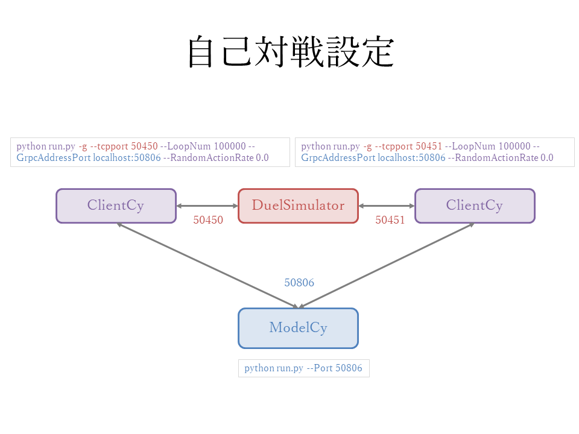
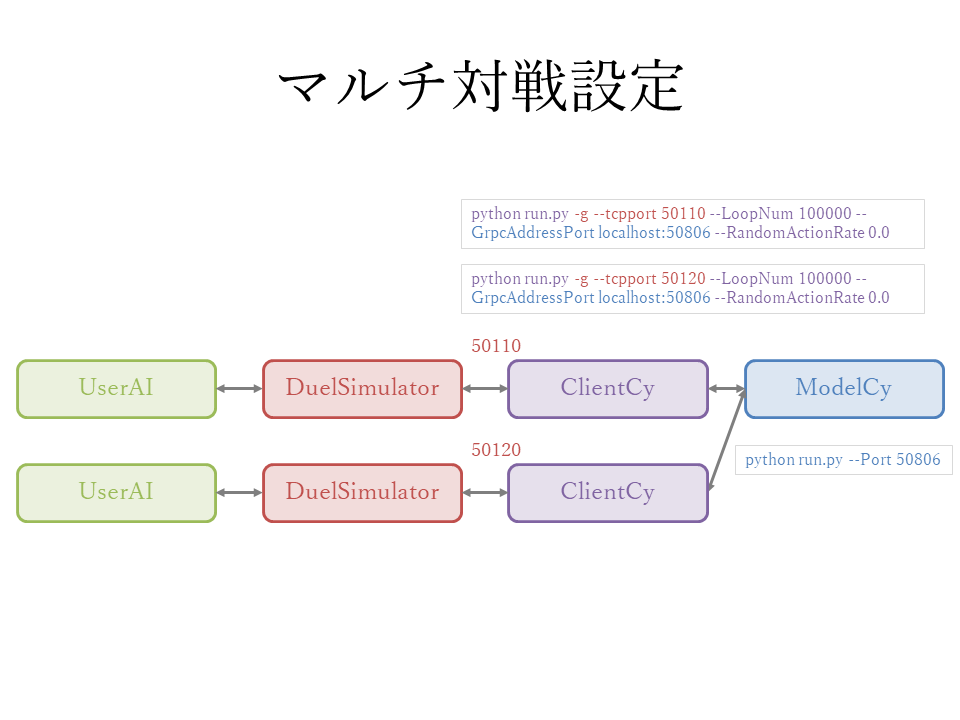
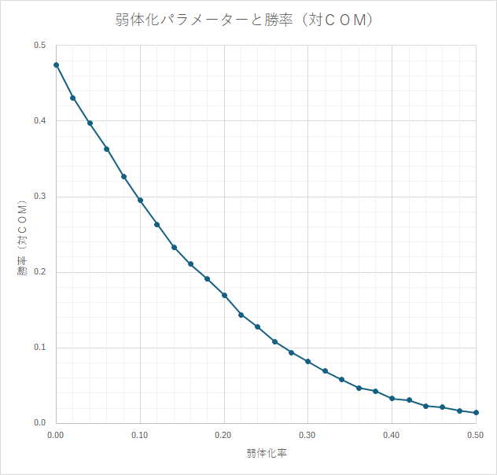

# Python仮想環境設定（Pythonは3.12を使用します）
環境作成

```
cd Workspace_OpponentAI
py -3.12.12 -m venv .venv
.venv\Scripts\activate
```

ライブラリ設定

```
pip install \UDI\libs\ygo
pip install torch==2.8.0 torchvision==0.23.0 --index-url https://download.pytorch.org/whl/cu129
pip install grpcio-tools==1.74.0
pip install pycryptodome==3.23.0
```
---

# 起動方法

## 自己対戦での例

自己対戦で動作確認を行います。



### ModelCy

```
python run.py --Port 50806
```

ModelCyは複数のClientCyを同じポートで接続できます。

### ClientCy
```
python run.py -g --tcpport 50450 --LoopNum 100000 --GrpcAddressPort localhost:50806 --RandomActionRate 0.0
python run.py -g --tcpport 50451 --LoopNum 100000 --GrpcAddressPort localhost:50806 --RandomActionRate 0.0
```

### DuelSimulator
```
DuelSimulator.exe --deck_path0 .\DeckData\RoyaleBE.json --deck_path1 .\DeckData\RoyaleBE.json --randomize_seed true --loop_num 100000 --exit_with_udi true --connect gRPC --tcp_host0 127.0.0.1 --tcp_port0 50450 --tcp_host1 127.0.0.1 --tcp_port1 50451 --player_type0 Human --player_type1 Human --play_reverse_duel true --grpc_deadline_seconds 60 --log_level 2
```

---

## 複数対戦設定



自己対戦設定から接続先を別のDuelSimulatorにすると複数対戦設定になります。

---

## CPU対戦

DuelSimulatorのplayer_type1をCPUにすることにより、AIvsCPUが実現できます。

ただし、このAIの対CPU勝率を測る以外の用途は特にありません。


```
DuelSimulator.exe --deck_path0 .\DeckData\RoyaleBE.json --deck_path1 .\DeckData\RoyaleBE.json --randomize_seed true --loop_num 100000 --exit_with_udi true --connect gRPC --tcp_host0 127.0.0.1 --tcp_port0 50450 --tcp_host1 127.0.0.1 --tcp_port1 50451 --player_type0 Human --player_type1 CPU --play_reverse_duel true --grpc_deadline_seconds 60 --log_level 2
```

# 弱体化パラメーター

## RandomActionRate

RandomActionRate設定を、0.000（強い）～ 1.000（弱い）に変えることにより、対戦用AIの強さを調節できます。

たとえば、0.2を設定した場合、0.2の確率でランダムにアクションを選択するようになります。

0.0～1.0で段階的に強くなるわけではありませんので、微調整は使用者側でお願いいたします。
（0.1、0.01、0.001など変えてみると良いかもしれません。）

```
python run.py -g --tcpport 50450 --LoopNum 100000 --GrpcAddressPort localhost:50806 --RandomActionRate 0.2
```


［参考］対COM（CPU）との勝率は下記の図になります。



---

# 表示画面と終了キー


### ModelCy

表示画面

```
run server
ServerRunning 0
```

Qキー（大文字）で終了

### ClientCy

表示画面

```
SendComandIndex: 0 (C=0.500 S=0.500)
SendComandIndex: 5 (C=0.500 S=0.500)
SendComandIndex: 1 (C=0.500 S=0.500)
SendComandIndex: 0 (C=0.500 S=0.500)
SendComandIndex: 4 (C=0.500 S=0.500)
SendComandIndex: 0 (C=0.500 S=0.500)
SendComandIndex: 2 (C=0.500 S=0.500)
SendComandIndex: 0 (C=0.500 S=0.500)
SendComandIndex: 0 (C=0.500 S=0.500)
SendComandIndex: 0 (C=0.500 S=0.500)
SendComandIndex: 3 (C=0.500 S=0.500)
```

Qキー（大文字）で終了

### DuelSimulator

表示画面

```
■[seed:1217577352]全985試合中[p0]が442勝（先攻258/493勝, 後攻184/492勝）LP0:6400 LP1:7900 Time(s): 12377.886
■[seed:1217577352]全985試合中[p0]が442勝（先攻258/493勝, 後攻184/492勝）LP0:6400 LP1:7900 Time(s): 12377.894
■[seed:1217577352]全985試合中[p0]が442勝（先攻258/493勝, 後攻184/492勝）LP0:6400 LP1:7900 Time(s): 12377.902
■[seed:1217577352]全985試合中[p0]が442勝（先攻258/493勝, 後攻184/492勝）LP0:6400 LP1:7900 Time(s): 12377.909
■[seed:1217577352]全985試合中[p0]が442勝（先攻258/493勝, 後攻184/492勝）LP0:6400 LP1:7900 Time(s): 12377.917
```

（ClientCyが終了することにより、自動終了）


